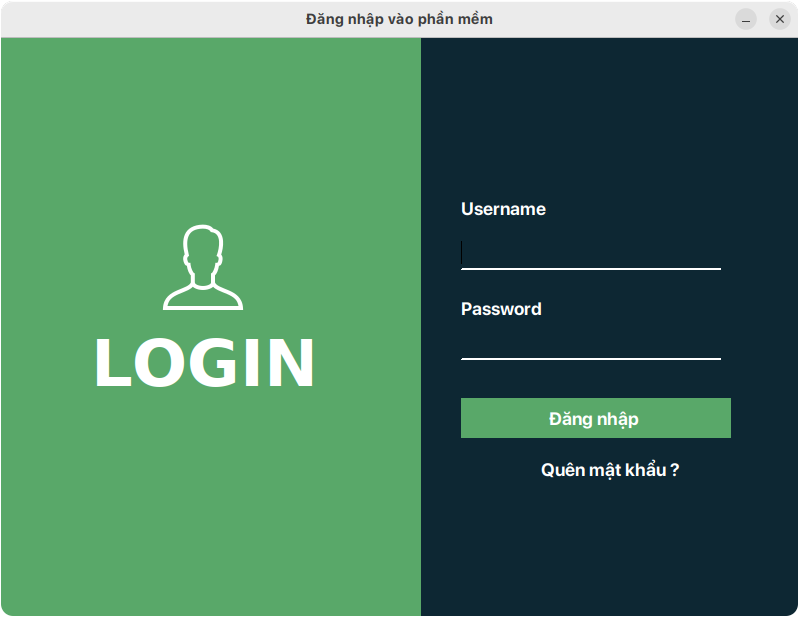
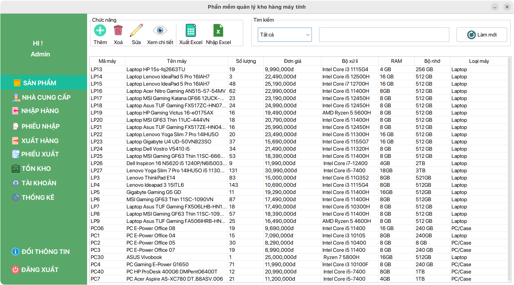
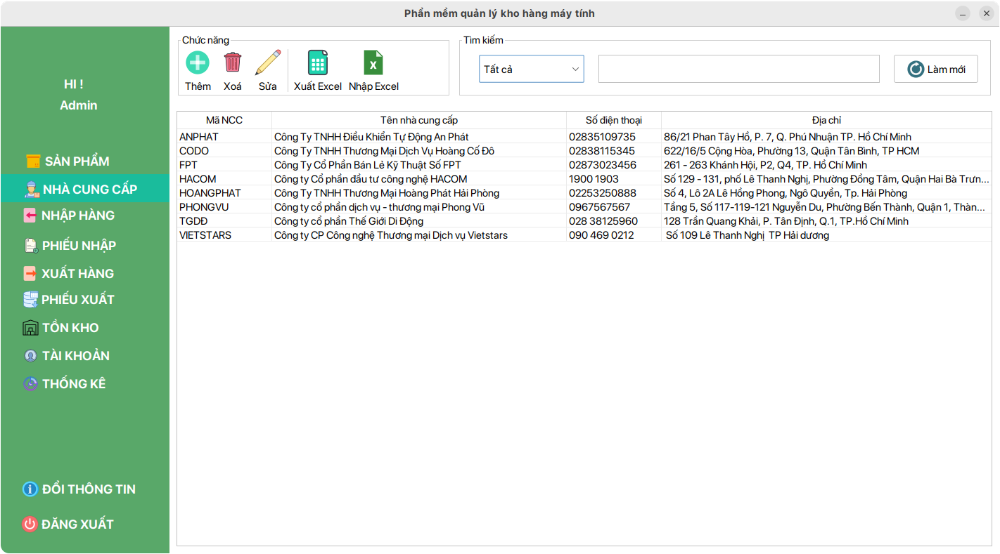
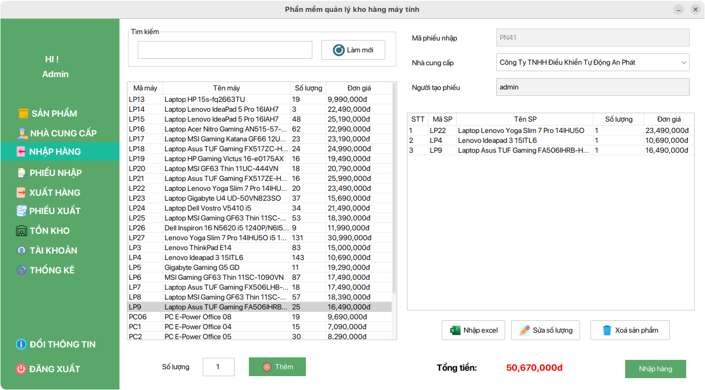
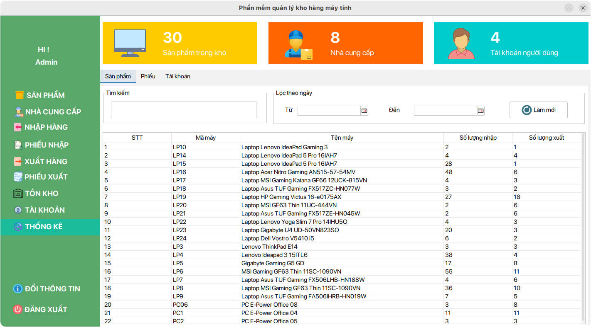
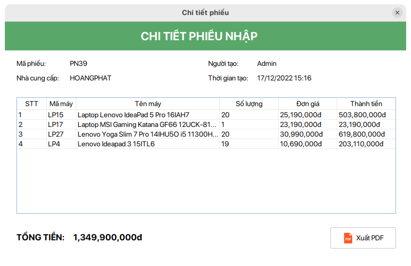
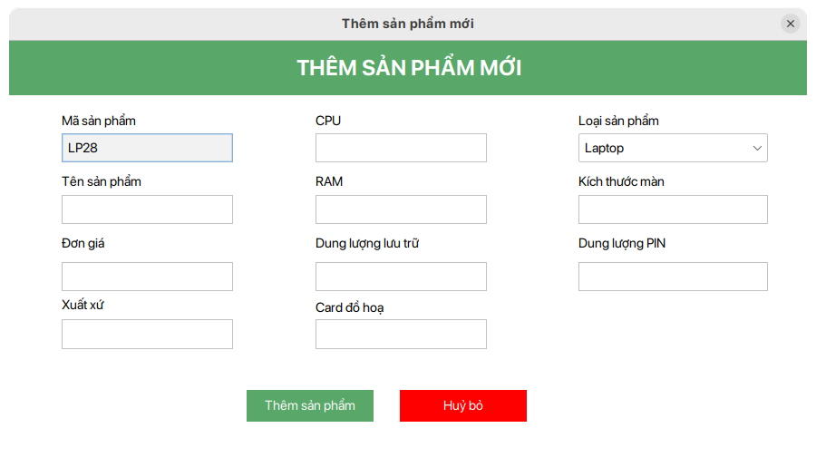

<!-- author: hgbaodev -->
# Quản lý kho hàng máy tính
Đồ án môn Lập trình hướng đối tượng sử dụng Java Swing + MySQL
## Getting Started

1. Tải source code về:

   ```bash
   git clone https://github.com/hgbaodev/QuanLyKhoHangMayTinh.git
   ```
2. Mở xampp và vào trang http://localhost/phpmyadmin/ tạo 1 database mới có tên là quanlimaytinh và import cơ sở dữ liệu trong folder database trong source code.

3. Sử dụng netbeans để chạy source code.

### Tài khoản ADMIN
- Tài khoản: admin
- Mật khẩu: 123456

### Giao diện 







